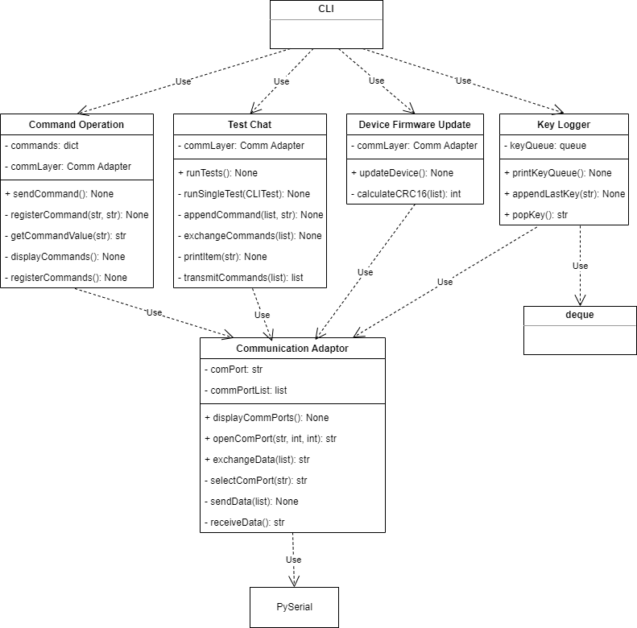

# Command Line Interface Application for Interaction with Embedded Devices

## CLI Application Introduction
The CLI application is a Python based utility that enables users to communicate with an embedded device such as a microcontroller or a microprocessor. With minimal prerequisites and configurations, this tool allows the users to begin communication to the embedded device for device configuration, control or firmware updates.

#### Prerequisites
+ [Python](https://www.python.org/downloads/) 3.10.2 or higher
+ Embedded device connected to the PC and capable of UART communication
	
### Embedded Firmware
+ The CLI application was tested using [ATmega4809 Curiosity Nano Development Board](https://www.microchip.com/en-us/development-tool/DM320115).
+ The firmware programmed on the board for communicating with the CLI application is available in [CLI Firmware ATmega4809](https://github.com/MMMRepos/cli-firmware.git).

### Running the CLI Application
The CLI application can be invoked from a terminal or command prompt as follows:
1. Open a command prompt on your system
2. In the command prompt, navigate to the folder on your system where this repository is cloned
3. Type cli.py and press enter to start the CLI application
4. Refer to the [Demo](#demo) section for viewing the CLI application in action.

## CLI Application Design
+ The CLI application uses PySerial module for communicating with the embedded device using UART
+ Information on classes used by the applications
  + CommandOperation
  + TestChat
  + DeviceFirmwareUpdate
  + KeyLogger
  + ComunicationAdapter
+ The design of the system is as shown below

+ Components
  + The CLI application is responsible for taking input from the user and processing it by using the underlying classes
  + The CLI application allows the user to select a number from the 4 available choices:
    1. Send Command
	2. Run Test
	3. Update Device
	4. Close
  + Depending on the user's input, the choice is routed to the corresponding class for handling that input.
	+ The **CommandOperation** class handles registering commands, displaying the list of available commands and sending messages for 3 commands to the hardware:
	  - Command: Hello		Message: Hello, it is nice to meet you.
	  - Command: Good Bye		Message: I need to run; but it has been great talking.
	  - Command: Hold Please 	Message: Excuse me a moment, someone else is here.
	  - Based on the command selected by the user, the corresponding message is sent to the embedded device
	+ The **TestChat** class runs 3 tests when instructed by the user. 
	  - Quick Chat
	    - Commands sent: Hello + Good Bye + Terminator
	  - Extended Call
	    - Commands sent: Hello + Hold Please + Terminator + Hold Please + Good Bye + Terminator 
	  - On Hold
		- Commands sent: Hello + Hold Please + Good Bye + Terminator + Hold Please + Terminator + Hold Please + Terminator + Hello + Good Byte + Terminator
	  - The class in a way such that it is easy to add more tests to it in the future
    + The **DeviceFirmwareUpdate** class sends a new firmware image to the embedded device for bootloading
	  - The image is sent in packets of 18 bytes at a time
	  - Packet structure
	    - The imaage is divided into chunks of 16 bytes of data
		- CRC16 is calculated for the 16 byte data and is appended at the end of 16 bytes
		- CRC16 CCITT-FALSE algorithm is used for calculation of CRC16
		- The resulting packet size if 18 bytes, which is sent to the device
	+ The **KeyLogger** class is used to maintain a log of the commands entered by the user 
	  - A history of last 500 commands is maintained by the KeyLogger
   	  - The KeyLogger uses circular buffer by leveraging the Python deque class from the collections module
	  - Everytime a new command is received, it is stored in the circular buffer
	  - If the number of comands stored in the cirular buffer exceed 500, the oldest command is overwritten by the newest command (First In First Out order)
	+ The **CommunicationAdapter** class is responsible for handling the UART communication with the embedded device
	  - This class uses the **PySerial** module for communicating with the hardware over UART
	  - This class is responsible for displaying the list of available COM ports, opening the COM port selected by the user (if it is available) using the specified baud rate and timeput settings and exchanging data over the open COM port
	  - The CommandOperation, TestChat, DeviceFirmwareUpdate classes all depend on the CommunicationAdapter class for sending commands or data to the embedded device
	

## Testing

## Improvements
